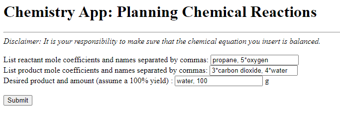
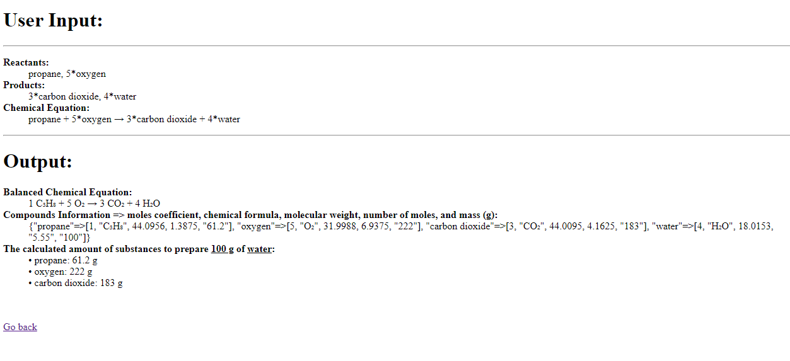

<h1> Chemical Equations App</h1>

<i>About</i>

<p> 
When chemists carry out chemical reactions, they start by writing out the chemical equations. Next, they balance the equations. Using the balanced equations, they can determine the amount of each substance required to synthesize the desired amount of the target compound.

This app will allow a chemist to enter the reactants and products of a chemical reaction by their substance names, as well as the desired amount of the target compound in grams. Using a chemistry API like NIST Webbook (https://webbook.nist.gov/chemistry/), the Royal Society of Chemistry (https://developer.rsc.org/apis), or MKS Web (https://www.molecularknowledge.com/Help/WebInterface/WebInterface.html), the chemical names are translated into chemical formulas. The information is then parsed into the individual elements and their ratios. Next, the substance coefficients are calculated. Finally, the amounts of the reactants and the side products will be listed as the output. 

Balancing chemical equations is not a trivial task, yet it is a routine calculation carried out by synthetic chemists. I believe that students and professionals will appreciate and find this app useful.

How to use:
- The user enters a list of reactants and products, including mole coefficients, along with the target compound and its amount (in grams). 
- Upon clicking the submit button, the chemical names are translated into chemical formulas. Additionally, the molecular weight of each compound is extracted from the NIST webbook. Subsequently, the number of moles of the target compound and the corresponding masses are calculated. </li>

<br>
The figures below show the example input and output pages:
<br>
<br>

<br>
Figure 1. An example input page.
<br>
<br>

<br>
Figure 2. An example output page. 
<br>
<hr>

<b>Appendix </b>

A. Install Ruby on a windows machine

1. I wasn't able to run my codespaces to edit my ruby file, so I decided to edit and run my ruby files on my desktop using visualstudo code.

2. First, I had to install a ruby compiler following the instructions described in this video: https://www.youtube.com/watch?v=XC1ccTyhLPI.

3. I downloaded the installer (v.3.2.4-1 (x64)) from https://rubyinstaller.org/downloads/.

4. Upon successful installation, a cmd.exe window opened up. Press enter to finish off the installation process.

5. Go to environment variables by going to settings and searching for environmental variables for your account. Select edit system environmental variables. Click on environmental variables. Under System variables, look for Path. Confirm that C:\Ruby32-x64 has been added.

6. To test installation, open up a command window by typing cmd in the search box and type ruby -v to get the ruby version. In my case, the output is ruby 3.2.4 (2024-04-23 revision af471c0e01) [x64-mingw-ucrt]. You can also type gem -v to get the gem version. In my case, it is version 3.4.19. Finally, you can type gem list to get the list of the installed gems. 

7. To run the ruby app from the command prompt, navigate into the folder directory and type ruby app.rb. I received an error message, "86:in `require': cannot load such file -- sinatra..."

8. Type bundle install to make sure that all required gems are installed. I got an error message, "Your Ruby version is 3.2.4, but your Gemfile specified 3.2.1". Within gemfile, change 3.2.1 to 3.2.4 and re-run bundle install. Remember to include gem "hhtp" within Gemfile.

9. Re-run ruby app.rb.

10. To view the web-page, copy and paste http://127.0.0.1:4567 onto a browser.

<hr>

B. sinatra-template

Use this repository to create new Sinatra apps. 

Optionally, to use `ActiveRecord` for database operations, add to the `app.rb`:

```ruby
require "sinatra/activerecord"
```

And in the `config/environment.rb` file add this code block:

```ruby
configure do
  # setup a database connection
  set(:database, { adapter: "sqlite3", database: "db/development.sqlite3" })
end
```

• Additional information about chemistry apis can be found here: https://chem.libretexts.org/Courses/University_of_Arkansas_Little_Rock/ChemInformatics_(2015)%3A_Chem_4399_5399/Text/8_Interacting_with_Databases%3A_Desktop_and_Web_based_Applications

• A ruby gem for converting chemical formula to mass: https://www.rubydoc.info/gems/chemistry_paradise/. The gem 'chemistry_paradise', however, cannot be found.
